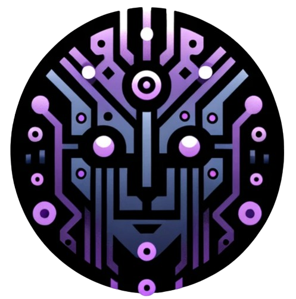

# Twitter LLM Bot

Welcome to the Automatic AI-Powered Twitter Bot project! 
This Python project leverages Hugging Face's LLM (Large Language Model) technology and Langchain to create an automatic Twitter bot that generates contextual content. 
This README file will guide you through setting up, configuring, and using this Twitter bot.

## Getting Started
Before you start exploring and experimenting with the Transformer architecture, you'll need to set up your environment. Here's how to get started:

## Prerequisites
Before you begin, ensure you have the following prerequisites:

- Python 3.11 or higher
- Redis
- A Twitter Developer Account (for API keys and tokens)
- Open AI API keys

## Installation

### Project
Clone this repository to your local machine:

```bash
# Clone the repository
git clone https://github.com/garyb9/twitter-llm-bot.git

# Change to the project directory
cd twitter-llm-bot

# Create a virtual environment (optional but recommended)
python -m venv venv

# Activate the virtual environment
source venv/bin/activate  # On Windows, use 'venv\Scripts\activate'

# Install project dependencies
pip install -r requirements.txt
```
### Redis
Follow this page for downloading & installation steps:
[Redis](https://redis.io/docs/install/install-redis/)


## Configuration
Before you can use the Twitter bot, you need to set up the necessary configuration. Create a .env file in the project root directory with the following content:

```.env
[HuggingFace]
HUGGINGFACE_HUB_CACHE = path_to_cache
TRANSFORMERS_CACHE = path_to_cache

[Twitter]
TWITTER_API_KEY = your_consumer_key
TWITTER_API_KEY_SECRET = your_consumer_secret
TWITTER_ACCESS_TOKEN = your_access_token
TWITTER_ACCESS_TOKEN_SECRET = your_access_token_secret

[Open AI]
OPENAI_ORG_ID = your_org_id
OPENAI_API_KEY = your_api_key
```

*** Note - its important to set the HuggingFace cache paths. Otherwise HF will download pre-trained models into default cache (might overwhelm with size).
Please refer to [Hugging Face cache setup](https://huggingface.co/docs/transformers/installation#cache-setup) guide for more information.

## Usage

Connect to Redis
You can test that your Redis server is running by connecting with the Redis CLI:

```bash
redis-server 
localhost:6379> ping
PONG
```

To run the Twitter bot, execute the following command:
```bash
python ./src/main.py
```

Test project using:
```bash
pytest
or
python -m pytest
```

## Docker Setup

To simplify the setup and ensure a consistent environment for development and production, this project supports Docker. Follow the steps below to get the Twitter bot running inside a Docker container using Docker Compose.

### Docker Prerequisites
- Docker installed on your machine. Installation guides for Docker can be found at [Docker's official website](https://docs.docker.com/get-docker/).
- Docker Compose installed on your machine (for Docker Desktop users, it's included). Check the installation guide at [Docker Compose's official website](https://docs.docker.com/compose/install/).

### Building the Docker Image

To build the Docker image for the Twitter bot, run the following command in the project root directory:

```bash
sudo docker-compose build
```

### Running the Bot with Docker Compose
The bot will start generating and posting tweets based on the prompts you specify in the code. You can customize the bot's behavior by modifying the prompts.
```bash
sudo docker-compose up
```
Or simply use:
```bash
sudo docker-compose up --build
```

### Stopping the Bot
To stop the Twitter bot and any related services running via Docker Compose, run:
```bash
sudo docker-compose down
```

### Flushing Redis through docker-compose

```bash
sudo docker-compose exec redis redis-cli -p 6380 FLUSHALL
```

## Contributing
If you want to contribute to this project, please follow these steps:

1. Fork the repository on GitHub.
2. Create a new branch and make your changes.
3. Write tests for your changes.
4. Submit a pull request, describing your changes and their purpose.

Contributions are welcome!

## License
This project is licensed under the MIT License - see the LICENSE file for details.

Feel free to contact us if you have any questions or encounter issues while using this Twitter bot. Happy tweeting!
